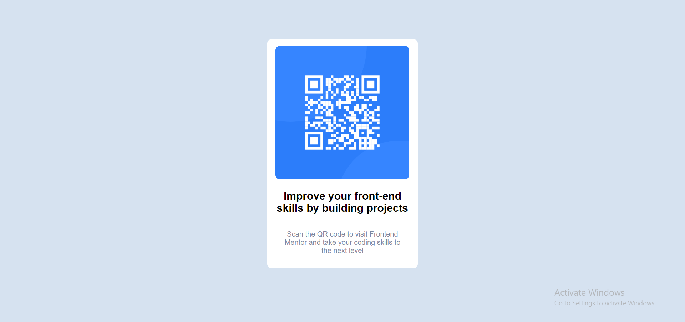

# Frontend Mentor - QR code component solution

This is a solution to the [QR code component challenge on Frontend Mentor](https://www.frontendmentor.io/challenges/qr-code-component-iux_sIO_H). Frontend Mentor challenges help you improve your coding skills by building realistic projects. 

## Table of contents

- [Overview](#overview)
  - [Screenshot](#screenshot)
  - [Links](#links)
- [My process](#my-process)
  - [Built with](#built-with)
  - [What I learned](#what-i-learned)
  - [Continued development](#continued-development)
  - [Useful resources](#useful-resources)
- [Author](#author)
- [Acknowledgments](#acknowledgments)

**Note: Delete this note and update the table of contents based on what sections you keep.**

## Overview
I basically did a clone of the qr-component-main.
### Screenshot



### Links
- Live Site URL: [Add live site URL here](https://codemaestro-qr-component-main.netlify.app)

## My process
1. I started by following the process advice given.
2. I started with listing out the HTML tags I will use and made the HTML layout of the project.
3. Then I linked to the HTML to the CSS and styled my work.

### Built with
- Semantic HTML5 markup
- CSS custom properties
- Flexbox
- CSS Grid
- Media Query for the Mobile app

### What I learned

I learned a proper way to start programming by starting with the HTML first then the CSS. I also learned how to do CSS variables.


```html
<h1>Some HTML code I'm proud of</h1>
```
```css
:root {
    --font-family: 'Outfit', sans-serif;
}
```


### Continued development

Use this section to outline areas that you want to continue focusing on in future projects. These could be concepts you're still not completely comfortable with or techniques you found useful that you want to refine and perfect.


## Author

- Website - [https://codemaestro-qr-component-main.netlify.app]
- Frontend Mentor - [@CodeMaestro-dev]

## Acknowledgments
 I would like to thnak Mr. Golden who put me through the course of the HTML 5 nad CSS 3.
